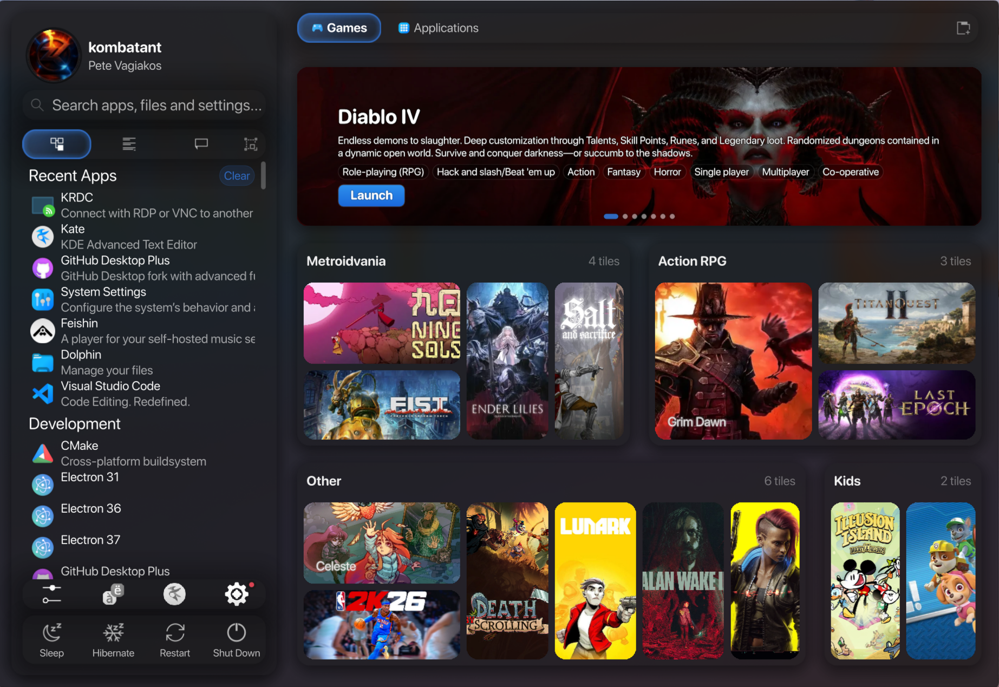
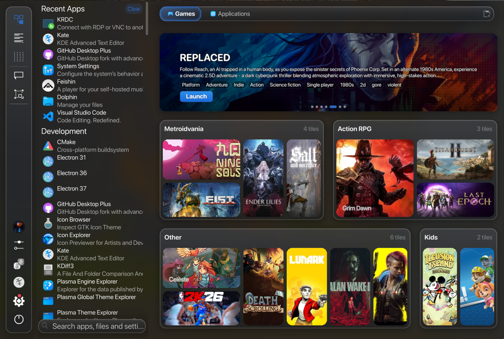
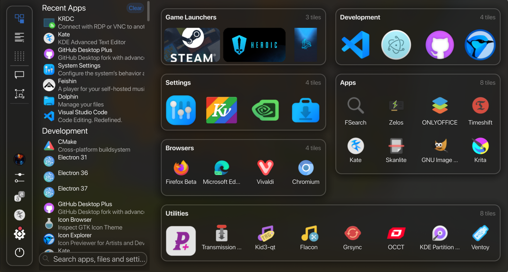
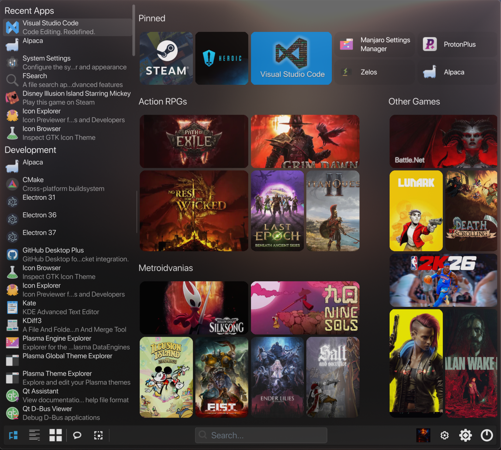
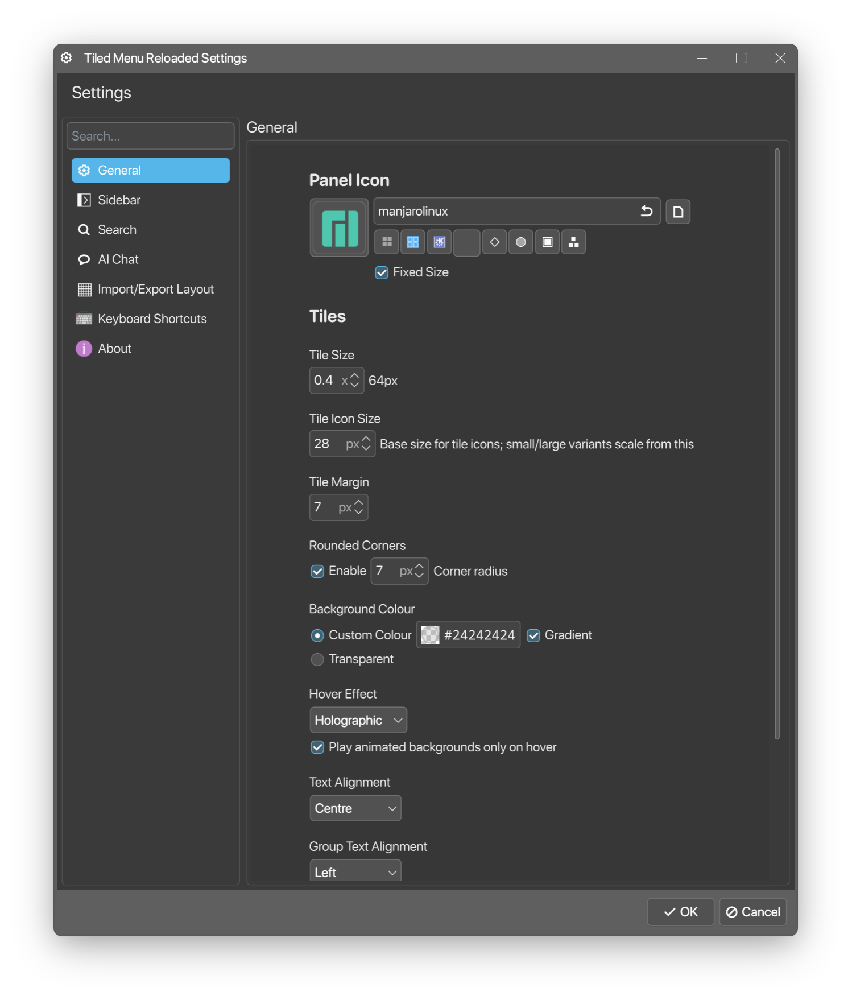
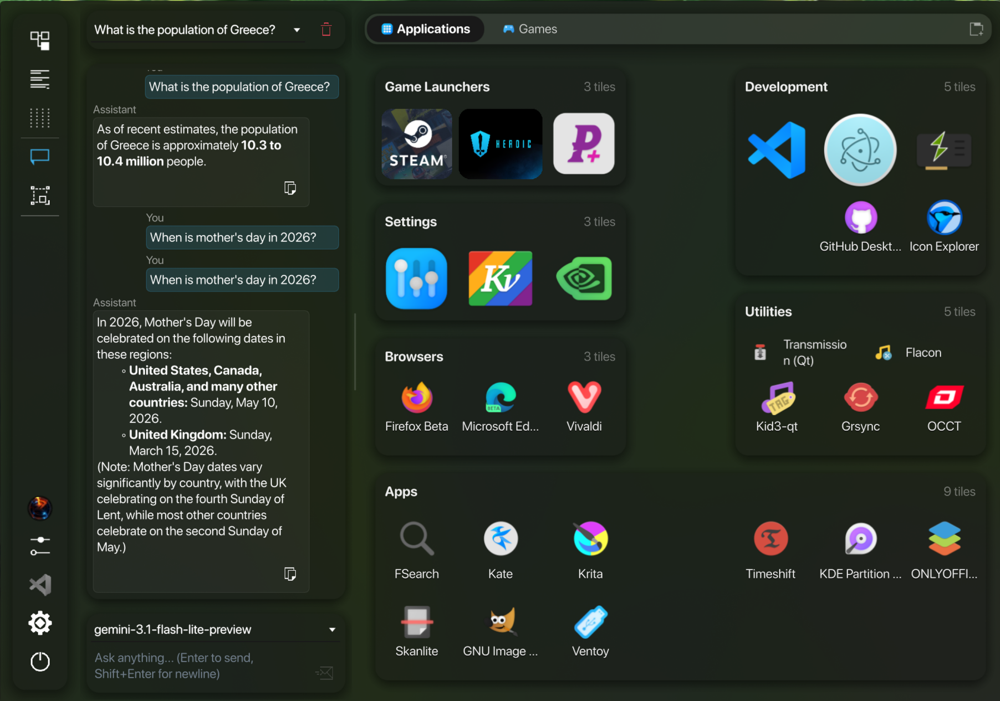

# Tiled Menu Reloaded

Tiled Menu Reloaded is a Plasma applet that provides a tiled launcher loosely inspired by Windows 10's start menu. It offers flexible tile layouts, groupable tiles, and configurable shortcuts while targeting Plasma 6 and Qt6 compatibility. 

> [!IMPORTANT]  
> Used various LLMs as a playground for code generation and assistance in forking/structuring/coding the project.





## Origins
- Forked from zren's (kind of abandoned) Tiled Menu: https://github.com/Zren/plasma-applet-tiledmenu

## Key goals:
- Provide an attractive, editable tile-based application launcher.
- Make common launcher workflows (pinning, grouping, quick search) fast and discoverable.
- Support modern Qt6/Plasma 6 environments.

## Highlights
- **New with 0.96 version**: Update notifications, UI design refinements and optimizations.
- Hero carousel tiles, including support for IGDB game metadata fetching. Support for Steam, Heroic and Lutris game entries.
- Docked Sidebar layout - with support for custom user avatars (animated or static).
- Tabs support in the tile area.
- Added a AI Chat tab to the sidebar, which can be used to interact with various LLMs. 
- Tile-based launcher with configurable sizes (1×1, 2×2, 4×4, and mixed layouts). 
- Rounded tiles with customizable corner radius now supported.
- Group tiles with headers; move and sort items within groups.
- Drag-and-drop pinning from file manager and search results.
- Animated tile support (GIF, APNG, WEBP) and per-tile background images. **Make sure you use reasonably sized images for good performance.**
- Configurable sidebar position, shortcuts and search filters.
- Quick search/filtering of applications and files.
- Stores tile layouts in config-backed encoded data, including the legacy Base64-encoded XML layout and tabbed tile layouts.
- New default preset images folder: ~/Pictures/TiledMenuReloaded, configurable in settings.

<details>
<summary><h2>Click here for more screenshots</h2></summary>










</details>

## Installation

### Option A — Using kpackagetool6 (recommended)

1. Download and extract the release zip, then from inside the extracted folder run:

    ```bash
    kpackagetool6 --type Plasma/Applet --install .
    ```

    (Use `--upgrade` instead of `--install` to update an existing installation.)

2. Restart Plasma Shell:

    ```bash
    kquitapp6 plasmashell && nohup plasmashell --replace > /tmp/plasmashell.log 2>&1 &
    ```

### Option B — Manual copy

1. Extract the zip and rename the folder to match the plugin ID:

    ```bash
    mkdir -p ~/.local/share/plasma/plasmoids/
    unzip <package>.zip
    mv plasma-applet-tiledmenurld-* ~/.local/share/plasma/plasmoids/org.github.kombatant.tiled_rld
    ```

2. Restart Plasma Shell:

    ```bash
    kquitapp6 plasmashell && nohup plasmashell --replace > /tmp/plasmashell.log 2>&1 &
    ```

### Then

Add the applet: right-click your application launcher, choose "Show Alternatives", and select "Tiled Menu Reloaded".

## Usage
- Pin items: right‑click an application or file and select "Pin" or drag it to the tile grid.
- Edit tiles: use the tile editor to change label, icon, background image, size, and placement.
- Groups: create a new group from the grid context menu; drag tiles into groups and use the group header to sort.
- Resize the launcher panes using the resize handle between the app list and tile area, or use the Auto Resize button in the sidebar.

## Configuration
- Settings are available from the applet configuration dialog. Important options include default tile folder, tile scale, grid columns, and search filters.

## Contact
- Plasmoid is still under active development, so any reported issues or feature requests are welcome. Report issues at: https://github.com/Kombatant/plasma-applet-tiledmenurld/issues

